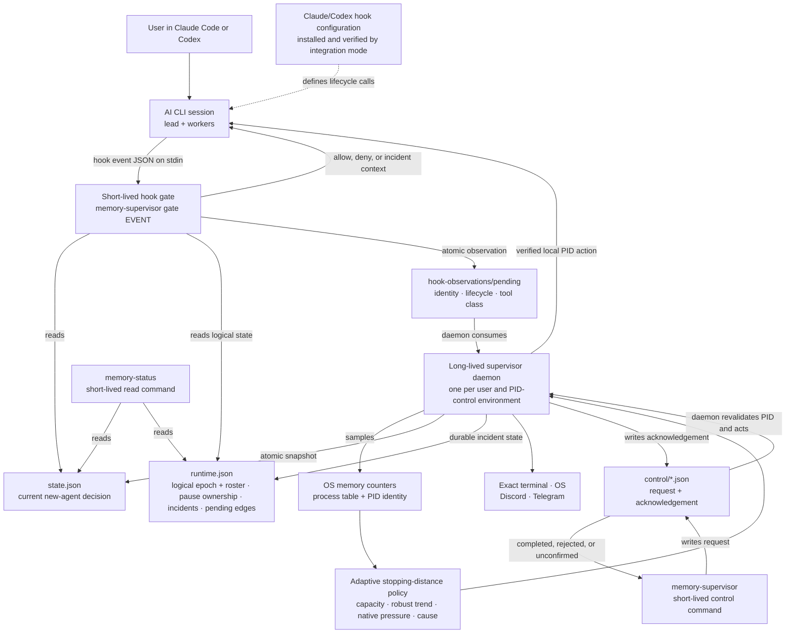
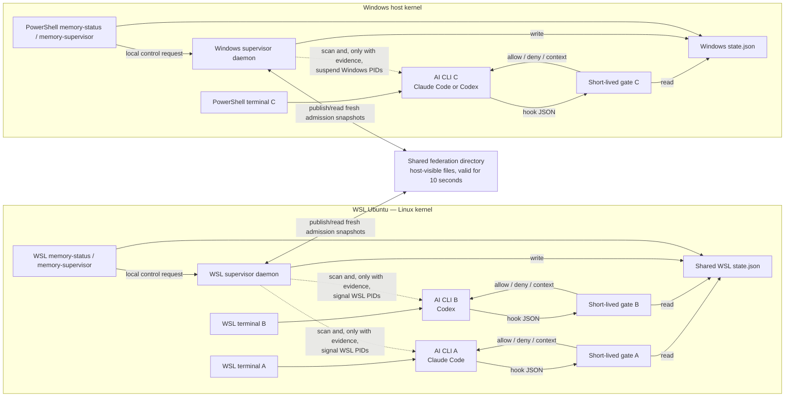

# アーキテクチャとランタイム トポロジ

<p align="center">
  <a href="architecture.md">English</a> · <a href="architecture.ko.md">한국어</a> · <a href="architecture.zh-CN.md">简体中文</a> · <strong>日本語</strong>
</p>

<a id="terminology-first"></a>
## まずは用語説明

| 学期 | このプロジェクトにおける正確な意味 |
| --- | --- |
| **ユーザー / オペレーター** | 端末を使用している人。 |
| **AI CLI** | 対話型セッションを所有し、hooks を呼び出す Claude Code または Codex アプリケーション。 |
| **Lead / メインエージェント** | 1 つの AI CLI セッションを調整するエージェント。 |
| **Worker / subagent** | lead によって作成された child エージェント。 |
| **論理エージェント** | セッションとエージェント ID によって識別される 1 つの AI ワークユニット。 複数の論理エージェントが 1 つのオペレーティング システム プロセスを共有する場合があります。 |
| **プロセス ID (PID)** | 実行中の 1 つのプロセスのオペレーティング システムの番号。 アクションは開始 ID に対して再検証されるため、再利用された番号は対象になりません。 |
| **PID 制御環境** | 1 つの daemon が 1 つの保護されたユーザー (ホスト、1 つの WSL ディストリビューション、VM ゲスト、または PID 分離コンテナー) の PID を列挙して通知できるローカル プロセスの名前空間。 必ずしも別個のカーネルである必要はありません。 |
| **Supervisor daemon** | 1 人の保護された OS ユーザーおよび PID 制御環境用の常駐ネイティブ プロセス。 可視リソースをサンプリングし、ポリシーを決定し、ローカル プロセス アクションを所有します。 |
| **Hook ゲート** | サポートされているライフサイクル イベントの前後に AI CLI によって開始される、`memory-supervisor gate <event>` の短期間の呼び出し。 |
| **Admission** | まだ始まっていない作業についての決定: 許可するか、観察しながら許可するか、新たな拡張を保留するか、今後の作業を減らすか。 これは、実行中のプロセスの一時停止とは別のものです。 |
| **Federation** | 同じ物理メモリを使用するローカル環境間で、最新の admission 決定のみを共有します。 リモート PID 制御は許可されません。 |
| **TTE** | 「枯渇までの時間」: 現在の減少が続いた場合に使用可能なメモリがなくなるまでの推定秒数。 |
| **Supervisor コマンド** | `memory-supervisor` および読み取り専用の `memory-status` ショートカット。これらは、supervisor を検査または制御するための端末コマンドです。 これらは、Claude Code または Codex セッションではありません。 |

従来のフィールド `provider` は、互換性インターフェイスでのみ存続します。 これは AI CLI タイプ (`claude` または `codex`) を意味し、ユーザー、アカウント、モデル ベンダー、オペレーティング システム、クラウド プロバイダーを意味するものではありません。

<a id="the-most-important-architectural-fact"></a>
## 最も重要な建築上の事実

Memory Supervisor は端末と AI CLI の間に存在しません。 打ち上げ滞在:

```text
terminal → claude
terminal → codex
```

それは**ではありません**:

```text
terminal → supervisor → claude/codex
```

1 つの daemon は、その OS ユーザーと PID 名前空間に表示される、サポートされている AI CLI プロセス ツリーを監視します。 hook 境界で、Claude Code または Codex が同じネイティブ バイナリを `gate` モードで一時的に開始します。 対話型 CLI はユーザーの端末に直接接続されたままになります。

<a id="program-architecture"></a>
## プログラムのアーキテクチャ



すべての実行可能ボックスは、1 つの Rust バイナリのモードまたはエイリアスです。 daemon のみが常駐します。 `gate`、`memory-status`、および `memory-supervisor` 制御動詞は、1 つの hook またはコマンドに対して続きます。 永続的に開いているソケットはありません。daemon は状態をアトミックに公開し、ゲートがそれを読み取り、手動プロセス アクションではプライベートなリクエスト/確認応答キューを使用するため、daemon は動作する前にターゲットを再検証できます。 Hook 観測は一方向のアトミック ファイルであり、2 番目のスケジューラーではありません。daemon はそれらを単調論理エポックに消費し、その後すべての lead が正確な制限されたロスターを受け取ります。

<a id="how-a-terminal-logical-agent-and-pid-map"></a>
## 端末、論理エージェント、および PID のマッピング方法

```text
exact terminal endpoint
└── AI CLI lead process: root PID + process start identity
    ├── logical lead: provider + session ID + `root` key
    ├── logical subagents: provider + session ID + agent ID
    │   └── may share the lead PID; they are not assumed to be OS processes
    └── OS descendants: worker/support PIDs
        └── tracked role/tree selects eligibility; PID + start identity is revalidated before signal
```

これらは別個のコントロール プレーンです。

| ターゲット | 安定した ID が使用される | 制御方法 | 正確な制限 |
| --- | --- | --- | --- |
| 将来のツールまたは subagent アクション | Hook ペイロードと論理セッション/エージェント ID | 有効期間が短い `gate` 許可/拒否の結果 | 開始しようとしているアクションのみに影響します。 作業を巻き戻したり、プロセスに信号を送ったりすることはできません。 |
| AI CLI プロセスを共有する論理エージェント | プロバイダー、セッション、エージェントの ID は `runtime.json` に記録されます。 lead は `root` キーを使用します | 論理状態: `ACTIVE`、`NO_EXPANSION`、`LIGHT_WORK_ONLY`、または `HANDOFF_ONLY` | hooks で名前付きの将来の作業クラスを制限します。 共有 PID 内の 1 つのスレッドを OS 一時停止することはできません。 |
| A worker/サポートプロセス | PID とプロセス開始 ID。 追跡されたロールとプロセスとツリーの関係の選択資格 | Daemon が所有するローカルの一時停止/再開 | プロセス ID が正確に再検証された後、ローカル PID 制御環境内でのみ動作します。 |
| lead プロセス | ルート PID、開始 ID、および正確な端末 ID | 同じローカルのサスペンド/再開パス、端末 ID の事前チェックと必要な通知書き込みあり | 永続的な所有権を記録できない場合、またはその正確な端末が通知を受信できない場合、一時停止はロールバックされます。 |
| 端末/モデルのコンテキスト | POSIX TTY デバイス ID または Windows コンソール ID | 今ターミナルバナー; 次の hook での構造化されたインシデントのコンテキスト | ターミナルはアクチュエータではなく可視ルートであり、そこにコマンドは注入されません。 |

Linux および macOS では、TTY (端末デバイス) は `/dev/pts/` または `/dev/tty` で正規化され、supervisor の実効ユーザーが所有するキャラクターデバイスである必要があり、記録された `device:inode:rdev` の ID を保持する必要があります。 通知ではノンブロッキング書き込みが使用されます。 Windows では、supervisor はターゲット PID のコンソールに接続し、記録されたコンソールウィンドウとターゲット PID の ID を照合し、`CONOUT$` に書き込みます。

制御シーケンスは意図的に分割されています。

1. サポートされているアクションの前に、AI CLI は `gate` を呼び出します。 ゲートは現在のマシン admission と論理名簿を読み取り、1 つの制限された観測を発行し、許可/拒否の結果を返します。
2. 常駐の daemon は、ネイティブ メモリと可視のプロセス ツリーをサンプリングし、観察を消費し、`state.json` と永続的な論理/インシデント台帳を `runtime.json` に公開します。
3. `HOLD` は新しい拡張を閉じます。 `DRAIN` では、圧力や明示的な地方予算により、指名されたエージェントの今後の業務が徐々に制限される可能性があります。 外部からのみの圧力は、既存の AI の作業を制限したり一時停止したりすることはありません。
4. 物理的な一時停止は別のバックストップです。 追跡された役割/ツリーと成長の証拠により、適格な候補者が選択されます。 信号の直前に、daemon は正確な PID と開始 ID を再読み込みし、lead の場合、記録された端末が依然として同じ適格な端末であることを確認します。 その 1 つの PID を一時停止し、一時所有権とインシデントを記録して永続的に保持し、通知を書き込みます。 永続化または必要な lead 通知が失敗した場合、所有されていないまたは非表示の一時停止を残す代わりにプロセスを再開します。

Worker/サポート プロセスは別個の端末を所有できない場合があります。 したがって、彼らのインシデントは、lead の次の hook コンテキストと設定された OS またはリモート通知ルートを通じて表面化します。

<a id="three-simultaneous-terminals-two-wsl-one-powershell"></a>
## 3 つの同時端末: 2 つの WSL、1 つの PowerShell

端末 A と B は**同じ WSL ディストリビューションと保護されたユーザー**を使用するため、1 つのローカル PID 制御環境と daemon を共有します。 ターミナル C は Windows PowerShell でネイティブに実行され、別の Windows daemon を使用します。



| アイテム | 同じ WSL ディストリビューション内の A と B | WSL と Windows |
| --- | --- | --- |
| Supervisor daemon | 共有 | 別 |
| 検出容量 | 同じ WSL/cgroup の可視容量 | Linux ゲストと Windows ホストの容量を個別に測定 |
| Admission 決定 | ローカルでの決定の共有 | federation を通じて共有された最悪の新たな決定 |
| ハードキャップ | 1 つの WSL アグリゲート（明示的に有効化されている場合） | 制御環境ごとに個別のキャップ。 決してプールされなかった |
| PID一時停止/再開 | WSL daemon はローカル WSL PID で動作できます | どちらの daemon も、PID 制御環境外では PID を信号で送信できません |
| `memory-status --all` | 両方のローカル セッションを表示します | 両側からの新しいスナップショットを組み合わせることができます |

WSL 2 ディストリビューションは、別個の PID、マウント、ユーザー、および cgroup 名前空間を使用しながら、マネージド VM、Linux カーネル、およびホストバックアップ メモリ プールを共有できます。 したがって、各ディストリビューションには独自のローカル インスタンスが必要です。 Federation は admission のみを座標します。 RAM の合計の追加、workers の移動、リモート設定の変更、または WSL PID 信号を Windows メモリ再利用に変換することはありません。

<a id="tool-and-new-worker-execution-sequence"></a>
## ツールと新しいworkerの実行シーケンス

```mermaid
sequenceDiagram
    participant D as Local supervisor daemon
    participant S as state.json
    participant A as Claude Code or Codex lead
    participant G as Short-lived gate process

    loop every supervisor tick
        D->>D: sample native memory and visible AI CLI PIDs
        D->>D: evaluate adaptive policy and fresh federation peers
        D->>S: atomically publish effective admission state
    end

    A->>G: invoke broad PreToolUse with event JSON on stdin
    G->>S: read fresh machine admission and exact logical state
    alt ordinary work and logical state allows its class
        G-->>A: exit 0 without a denial
        A->>A: existing useful work continues
    else actual expansion in ALLOW or OBSERVE
        G-->>A: exit 0 without a denial
        A->>A: AI CLI may create the worker
    else actual expansion and HOLD or DRAIN persists through bounded recheck
        G-->>A: valid hook deny JSON + ADMISSION_DEFERRED
        Note over A: Existing work continues; the new worker is never created
    else exact logical state excludes this future-work class
        G-->>A: valid deny with state, epoch, reason, and current roster
        Note over A: Result, message, status, stop, and recovery paths remain open
    else state is missing, stale, malformed, or unreadable
        G-->>A: fail open with exit 0
        Note over D: Independent daemon/PID protection remains the backstop
    end
```

daemon は、測定、適応バッチサイズ、およびポリシーを所有します。 ゲートは現在の入力のみを分類し、割り当て前に最新のスナップショットを適用します。 これにより、hooks の速度が維持され、中央のネットワーク サービスなしで A、B、C が調整されます。

<a id="repository-file-structure"></a>
## リポジトリのファイル構造

```text
Calando/
├── README.*                    concise public entry points in four languages
├── bootstrap.*                 stable one-line release installer
├── install.* + power.* + uninstall.* v0.2.0-compatible maintenance entrypoints
├── Cargo.toml + Cargo.lock     Rust package and pinned dependency graph
├── src/
│   ├── main.rs + lib.rs        one binary, subcommand and alias routing
│   ├── config.rs               defaults, overrides, notification configuration
│   ├── platform.rs             Linux/WSL, macOS, Windows sensors and PID actions
│   ├── policy.rs               adaptive levels, TTE, reserve, attribution, candidates
│   ├── containment.rs          logical states, tool classes, identities, strict runaway gates
│   ├── supervisor.rs           one-second control loop and protective actions
│   ├── runtime.rs + events.rs  durable pause/incident state and user messages
│   ├── gate.rs                 hook admission and incident-context response
│   ├── status.rs + control.rs  memory-status and memory-supervisor control behavior
│   ├── notify.rs + terminal.rs optional routes and exact-terminal delivery
│   ├── integration.rs          CLI version checks, owned hook merge, path migration
│   └── storage.rs              private directories and atomic/bounded file I/O
├── SKILL.md                    shared Claude Code/Codex operating skill
├── agents/                     Codex skill presentation metadata
├── integrations/
│   ├── claude/                 hook template and in-CLI status command
│   └── codex/                  hook template, adapter notes, and status command
├── packaging/
│   ├── install.*               transactional runtime, service, skill, and hook setup
│   ├── power.* + uninstall.*   persistent power control and owned removal
│   └── release/                source packaging and artifact verification
├── runtime/
│   ├── bin/                    compatibility command launchers
│   ├── hooks/                  fail-open hook wrappers
│   └── notifications/          default private-notification template and wrapper
├── docs/
│   ├── detailed-guide.*        complete four-language product guide
│   ├── guides/                 installation, usage, security, and architecture guides
│   └── testing/                public test coverage and reproducible results
├── tests/                      Rust, install, platform, and contract tests
└── .github/                    community documents and cross-platform test matrix
```

インストーラによって生成された hooks は、`memory-supervisor gate <event>` を直接呼び出します。 `runtime/hooks/` と `integrations/` はフェールオープン契約、互換性、およびテストを保持します。 彼らは別の居住者 daemon ではありません。 リポジトリ ルートにある短いメンテナンス ファイルは、v0.2.0 チェックアウト パスを保持し、`packaging/` に委任します。 新しいランタイム コードはグループ化されたパスを優先し、更新中に従来のレイアウトに戻ります。

<a id="installed-file-and-process-layout"></a>
## インストールされたファイルとプロセスのレイアウト

| 目的 | Linux / WSL / macOS | 窓 |
| --- | --- | --- |
| 維持されたチェックアウト | `~/.local/share/memory-supervisor` | `%LOCALAPPDATA%\MemorySupervisor` |
| ネイティブランタイム | `~/.local/lib/memory-supervisor/memory-supervisor` | `$HOME\.local\lib\memory-supervisor\memory-supervisor.exe` |
| ユーザーコマンド | `~/.local/bin/memory-supervisor` および `memory-status` のシンボリックリンク | `$HOME\.local\bin\*.cmd` ランチャー |
| 現在のスナップショットと実行時台帳 | `~/.cache/memory-supervisor/` | `$HOME\.cache\memory-supervisor\` |
| 構成 | `~/.config/memory-supervisor/` | `$HOME\.config\memory-supervisor\` |
| パス ポインターとデフォルト federation | `~/.memory-supervisor/` | `$HOME\.memory-supervisor\` |
| 永続的な電源状態 | `~/.memory-supervisor/power-off` | `$HOME\.memory-supervisor\power-off` |
| 長寿のスタートアップ | ユーザー systemd、macOS LaunchAgent、または監視対象フォールバック | `MemorySupervisor` スケジュールされたタスク |
| Claude Code 統合 | `~/.claude/settings.json`、スキルおよびコマンドディレクトリ | `$HOME` 以下も同じパス |
| Codex 統合 | `$CODEX_HOME/hooks.json` (それ以外の場合は `~/.codex/hooks.json`)、`~/.agents/skills`、互換性プロンプト/スキル | 環境は効果的です `CODEX_HOME`; スキルと互換性ファイルは `$HOME` の下に残ります |

チェックアウトではアップデートが提供されます。 コピーされたネイティブ ランタイムはサービスと hooks を提供します。 `memory-status` はそのバイナリのエイリアスであり、すべての制御動詞は `memory-supervisor` サブコマンドです。 端末や AI CLI ごとではなく、インストールされているユーザーおよび PID 制御環境ごとに 1 つの常駐 daemon があります。 `off` マーカーが存在する場合、daemon は実行されず、フェールオープン警告なしでゲートが通過します。 サービス登録と hook 配線はインストールされたままであるため、`on` はマーカーを削除して同じインストールを再開できます。

<a id="module-ownership-rules"></a>
## モジュールの所有権ルール

- `platform` は、低レベルのローカル PID 演算を測定および実行します。 政策を選択するものではありません。
- `policy` は停止距離、圧力、候補証拠を決定します。 信号は送信しません。
- `containment` は、論理アイデンティティ、ツール/状態契約、暴走証拠を定義します。 OS のアクションは実行されません。
- `supervisor` は、両方を組み合わせて永続的なアクションを記録する唯一の長命の所有者です。
- `gate` は、機密扱いの将来のアクションを許可/拒否し、コンテキストを提供できます。 プロセスを一時停止することはできません。
- `memory-supervisor` 制御動詞はアクションを要求します。 daemon はそれを再検証して実行します。
- `federation` は admission スナップショットのみを共有します。 すべての PID アクションは、それが所有する PID 制御環境に対してローカルなままです。

これらの境界により、ユーザーに特別なラッパーを介して Claude Code または Codex を起動させることなく、複数の端末が調整されます。
