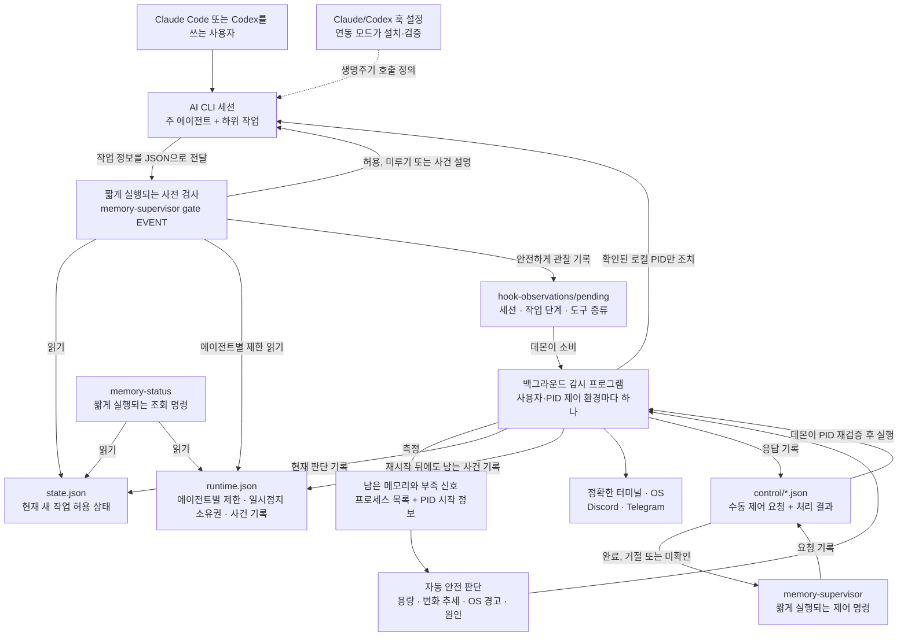
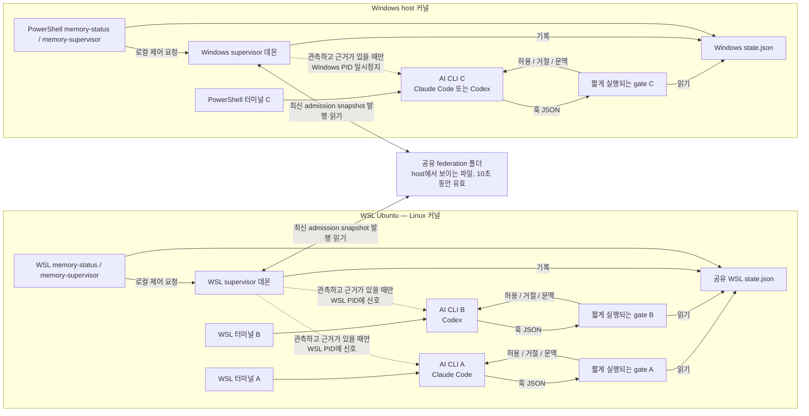
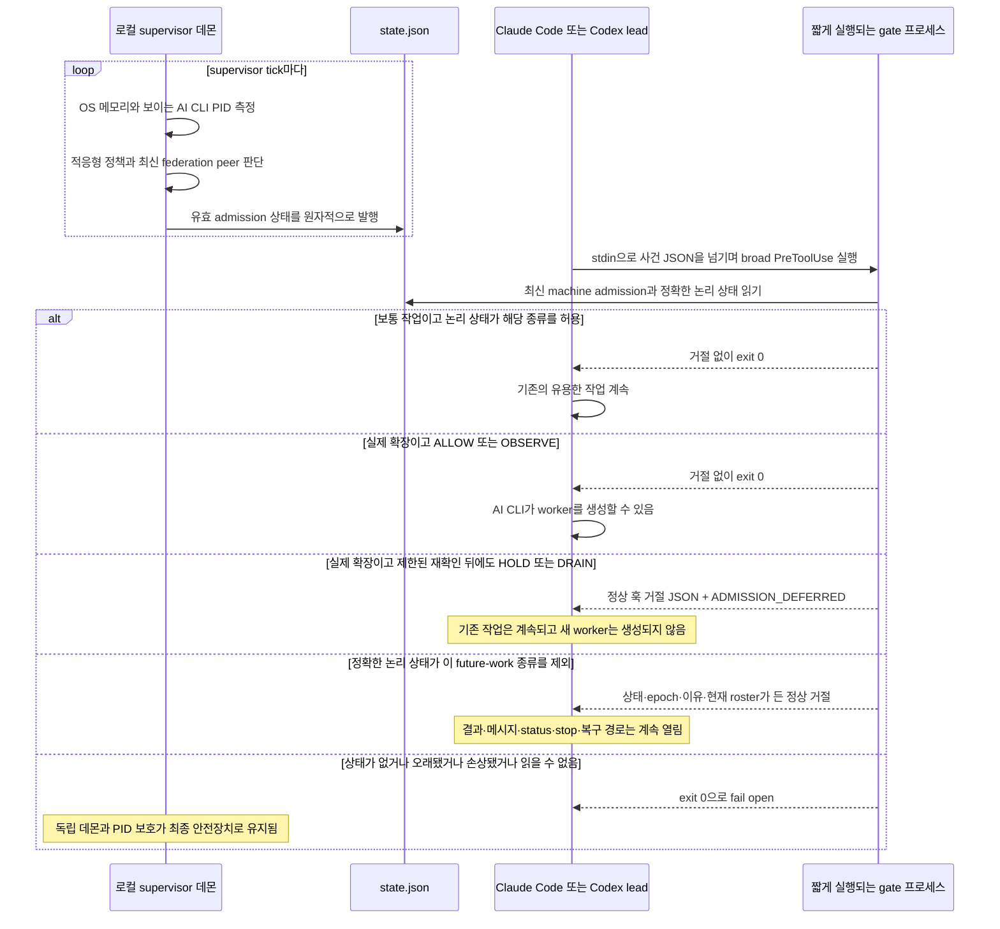

# 아키텍처와 실행 구조

<p align="center">
  <a href="architecture.md">English</a> · <strong>한국어</strong>
</p>

## 먼저 용어부터 명확히 구분합니다

| 용어 | 이 프로젝트에서의 정확한 뜻 |
| --- | --- |
| **사용자 / 운영자** | 터미널을 사용하는 사람입니다. |
| **AI CLI** | 대화형 세션을 소유하고 훅을 실행하는 Claude Code 또는 Codex 프로그램입니다. |
| **lead / main agent** | AI CLI 세션 하나를 조율하는 주 에이전트입니다. |
| **worker / subagent** | lead가 만든 하위 에이전트입니다. |
| **논리 에이전트** | 세션 번호와 에이전트 번호로 구분하는 AI 작업 단위입니다. 여러 논리 에이전트가 운영체제 프로그램 하나를 공유할 수 있습니다. |
| **프로세스 번호(PID)** | OS가 실행 중인 프로세스 하나에 붙인 번호입니다. 번호 재사용으로 오인하지 않도록 시작 정체성까지 다시 확인합니다. |
| **PID 제어 환경** | 감시 프로그램 하나가 사용자 한 명의 프로세스 목록을 읽고 일시정지·재개할 수 있는 범위입니다. Windows, WSL 배포판 하나, 가상 머신 하나, 프로세스가 격리된 컨테이너 하나가 각각 이런 범위가 되며, 반드시 서로 다른 커널이라는 뜻은 아닙니다. |
| **supervisor 데몬** | 사용자와 PID 제어 환경 하나를 계속 감시하는 백그라운드 프로그램입니다. 메모리를 측정하고 새 작업 허용 여부를 판단하며 로컬 프로그램의 일시정지·재개를 담당합니다. |
| **훅 gate** | AI CLI가 지원되는 작업의 시작 전후에 잠깐 실행하는 `memory-supervisor gate <event>` 검사 프로그램입니다. |
| **새 작업 허용 상태(admission)** | 아직 시작하지 않은 작업을 허용할지, 관찰하며 허용할지, 새 확장을 멈출지, 앞으로 할 일을 줄일지 나타냅니다. 실행 중인 프로그램의 일시정지와는 별개입니다. |
| **여러 환경 연동(federation)** | 같은 물리 메모리를 쓰는 로컬 환경끼리 최신 새 작업 허용 상태만 공유하는 기능입니다. 다른 환경의 PID를 제어하지는 못합니다. |
| **TTE** | “메모리 고갈까지 남은 시간”입니다. 현재 속도로 메모리가 줄어들 때 사용 가능한 메모리가 바닥날 것으로 예상되는 시간을 초 단위로 나타냅니다. |
| **supervisor 명령** | supervisor를 확인·제어하는 터미널 명령 `memory-supervisor`와 읽기 전용 단축 명령 `memory-status`입니다. Claude Code나 Codex 세션을 뜻하지 않습니다. |

과거 호환 인터페이스의 `provider`는 AI CLI 종류(`claude` 또는 `codex`)만 뜻합니다.
사용자·계정·모델 회사·OS·클라우드 사업자를 뜻하지 않습니다.

## 가장 중요한 아키텍처 사실

Memory Supervisor는 터미널과 AI CLI 사이에 끼어들지 않고 별도로 상태를 감시합니다.

```text
터미널 → claude
터미널 → codex
```

다음 구조가 아닙니다.

```text
터미널 → supervisor → claude/codex
```

백그라운드 감시 프로그램 하나가 현재 사용자와 같은 프로세스 공간에서 보이는 Claude Code·Codex
프로그램을 확인합니다. 지원되는 작업의 시작 전후에는 Claude Code나 Codex가 같은 실행 파일을
`gate` 검사 모드로 잠깐 실행합니다. 대화형 CLI는 계속 사용자 터미널에 직접 연결됩니다.

## 프로그램 아키텍처



그림의 실행 항목은 모두 Rust 실행 파일 하나를 서로 다른 방식으로 부른 것입니다. 백그라운드 감시
모드만 계속 실행되고 `gate`·`memory-status`·수동 제어 명령은 호출할 때만 잠깐 실행됩니다. 계속
열어 두는 네트워크 연결은 없습니다. 감시 프로그램이 상태 파일을 안전하게 교체하고 사전 검사가
이를 읽습니다. 수동 일시정지·재개 요청도 파일로 전달되며, 감시 프로그램이 대상을 다시 확인한
뒤 실행하고 결과를 기록합니다. 작업 관찰 기록은 별도 작업 스케줄러가 아니라 판단 근거를
전달하는 단방향 파일입니다.

## 터미널·논리 에이전트·PID의 대응 구조

```text
확인된 터미널
└── AI CLI 주 프로그램: root PID + 시작 정보
    ├── 논리 주 에이전트: CLI 종류 + session ID + `root`
    ├── 논리 서브에이전트: CLI 종류 + session ID + agent ID
    │   └── 주 에이전트와 PID를 공유할 수 있음
    └── 운영체제의 하위 프로그램: worker/support PID
        └── 역할·부모 관계로 후보를 고르고 일시정지 직전 PID·시작 정보를 다시 확인
```

제어면은 다음처럼 서로 분리됩니다.

| 대상 | 대상을 구분하는 정보 | 제어 방법 | 정확한 한계 |
| --- | --- | --- | --- |
| 실행 직전의 도구 또는 서브에이전트 작업 | 실행 전 전달 정보와 session/agent ID | 짧게 실행되는 `gate`가 허용하거나 미룸 | 지금 시작하려는 작업에만 영향을 주며 이미 실행한 작업은 되돌리지 못합니다. |
| AI CLI 프로그램을 공유하는 논리 에이전트 | `runtime.json`의 CLI 종류·session·agent ID, 주 에이전트는 `root` 사용 | `ACTIVE`, `NO_EXPANSION`, `LIGHT_WORK_ONLY`, `HANDOFF_ONLY` 상태 | 앞으로 할 작업 종류는 따로 제한할 수 있지만 공유 PID 안의 에이전트 하나만 운영체제 기능으로 멈출 수는 없습니다. |
| 별도 하위 작업·도구 프로그램(`worker`/`support`) | PID·시작 정보, 후보 선정에 쓰는 역할·부모 관계 | 감시 프로그램이 담당하는 로컬 일시정지·재개 | PID와 시작 정보를 다시 확인한 뒤 같은 로컬 환경 안에서만 조치합니다. |
| 주 프로그램 | root PID·시작 정보·정확한 터미널 정보 | 같은 일시정지·재개 경로에 터미널 사전 확인과 필수 알림 쓰기를 추가 | 일시정지 기록을 저장하지 못하거나 정확한 터미널에 알리지 못하면 즉시 재개합니다. |
| 터미널과 AI 문맥 | Linux/macOS 터미널 장치 또는 Windows console 정보 | 터미널에는 즉시 표시하고 AI에는 다음 사전 검사 때 사건 설명 전달 | 터미널은 알림 통로일 뿐이며 명령을 몰래 입력하지 않습니다. |

Linux와 macOS에서는 TTY(터미널 장치)가 `/dev/pts/` 또는 `/dev/tty` 아래의 실제 경로이고,
supervisor를 실행한 사용자가 소유한 문자 장치이며, 기록한 `device:inode:rdev` 값이 그대로여야
합니다. 알림 쓰기는 터미널 응답을 무기한 기다리지 않습니다. Windows에서는 대상 PID의 console에
연결한 뒤 기록한 console-window-plus-target-PID 값을 대조하고 `CONOUT$`에 씁니다.

제어 순서도 의도적으로 나뉩니다.

1. 지원되는 작업 직전에 AI CLI가 `gate`를 실행합니다. Gate는 현재 새 작업 허용 상태와
   에이전트별 제한 목록을 읽고 관찰 기록 하나를 남긴 뒤 허용·미루기 결과를 반환합니다.
2. 백그라운드 감시 프로그램은 운영체제가 보고한 메모리와 보이는 프로그램 목록을 측정하고
   관찰 기록을 읽은 뒤 `state.json`과 재시작 뒤에도 남는 사건 기록 `runtime.json`을 갱신합니다.
3. `HOLD`는 새 확장만 멈춥니다. `DRAIN`에서는 원인이 AI 작업으로 확인되거나 사용자가 정한
   로컬 메모리 한도를 넘었을 때 선택된 에이전트의 앞으로 할 일을 단계적으로 제한할 수 있습니다.
   외부 프로그램만 원인이면 기존 AI 작업을 제한하거나 일시정지하지 않습니다.
4. 프로그램 일시정지는 별도의 최종 안전장치입니다. 역할·부모 관계·증가 기록으로 후보를 고르고,
   일시정지 직전에 정확한 PID와 시작 정보를 다시 읽습니다. 주 프로그램이면 기록된 터미널이
   여전히 같은지도 먼저 확인합니다. PID 하나를 멈춘 뒤 일시정지 소유권과 사건을 파일에
   저장하고 알림을 씁니다. 저장이나 필수 주 프로그램 알림이 실패하면 즉시 재개합니다.

별도 하위 작업·도구 프로그램에는 자기 터미널이 없을 수 있습니다. 이 경우 사건은 주 에이전트의
다음 사전 검사와 설정된 운영체제·원격 알림을 통해 전달됩니다.

## 동시 터미널 세 개: WSL 두 개, PowerShell 하나

터미널 A와 B는 **같은 WSL 배포판과 보호 대상 사용자**를 쓰므로 로컬 PID 제어 환경과 데몬
하나를 공유합니다. 터미널 C는 Windows PowerShell에서 직접 실행하므로 별도 Windows 데몬을
사용합니다.



| 항목 | 같은 WSL distribution의 A와 B | WSL과 Windows 사이 |
| --- | --- | --- |
| Supervisor 데몬 | 하나를 공유 | 각각 별도 |
| 감지 용량 | 같은 WSL/cgroup 가시 용량 | Linux guest와 Windows host 용량을 따로 측정 |
| Admission 판단 | 같은 로컬 판단 공유 | federation을 통해 최신 판단 중 더 위험한 쪽 공유 |
| 하드캡 | 명시적으로 켠 경우 WSL 합산 상한 하나 | 제어 환경마다 따로 설정하며 합치지 않음 |
| PID 일시정지·재개 | WSL 데몬이 로컬 WSL PID에 조치 가능 | 자신의 PID 제어 환경 밖에 있는 PID에는 signal을 보낼 수 없음 |
| `memory-status --all` | 두 로컬 세션 모두 표시 | 양쪽의 최신 snapshot을 합쳐 표시 가능 |

WSL 2 배포판들은 관리형 VM·Linux 커널·host-backed 메모리 pool을 공유할 수 있지만 PID·mount·
user·cgroup namespace는 분리됩니다. 따라서 각 배포판에 로컬 instance가 필요합니다.
Federation은 admission만 조율하며 RAM 합산·worker 이동·원격 설정 변경·WSL PID signal로
Windows 메모리 회수는 하지 않습니다.

## 도구와 새 worker가 실행될 때의 순서



측정·적응형 batch 크기·정책은 데몬이 담당하고 gate는 현재 입력을 분류해 메모리 할당 전에 최신
결과만 적용합니다. 이 구조는 훅을 빠르게 유지하고 중앙 네트워크 서비스 없이 A·B·C를 조율합니다.

## 저장소 파일 구조

```text
Calando/
├── src/
│   ├── main.rs + lib.rs        단일 바이너리의 subcommand·별칭 routing
│   ├── config.rs               기본값, override, 알림 설정
│   ├── platform.rs             Linux/WSL·macOS·Windows 센서와 PID 조치
│   ├── policy.rs               적응형 단계, TTE, reserve, 원인·후보 판단
│   ├── containment.rs          논리 상태·도구 분류·identity·엄격한 폭주 gate
│   ├── supervisor.rs           1초 control loop와 보호 조치
│   ├── runtime.rs + events.rs  영속 pause·사건 상태와 사용자 메시지
│   ├── gate.rs                 훅 admission과 사건 문맥 응답
│   ├── status.rs + control.rs  memory-status와 memory-supervisor 제어 동작
│   ├── notify.rs + terminal.rs 선택 알림과 정확한 터미널 전달
│   ├── integration.rs          CLI 버전 검사, 소유 훅 병합, 경로 이전
│   └── storage.rs              비공개 폴더와 원자적·크기 제한 파일 I/O
├── SKILL.md                    Claude Code·Codex가 공유하는 운영 스킬
├── agents/                     Codex skill 표시 정보
├── commands/                   각 AI CLI 내부의 상태 확인 단축 명령
├── hooks/ + adapters/          fail-open wrapper와 호환용 template
├── bin/                        명령 launcher
├── bootstrap.*                 공개 release source·binary 설치와 update
├── install.* + power.* + uninstall.* runtime·service·skill·hook의 transaction 생명주기와 지속형 전원
├── notify/                     비공개 알림 기본 template와 wrapper
├── scripts/                    release source 묶음과 artifact 검증
├── docs/
│   ├── guides/                 설치·사용·보안·아키텍처 안내
│   └── testing/                공개 테스트 범위와 재현 가능한 결과
├── tests/                      Rust·설치·플랫폼·계약 test
├── .github/workflows/         Linux/Windows/Apple Silicon 테스트 matrix
└── Cargo.toml + Cargo.lock     Rust package와 고정 dependency graph
```

설치기가 생성한 훅은 `memory-supervisor gate <event>`를 직접 실행합니다. `hooks/`와 `adapters/`는
fail-open 계약·호환성·test용이며 또 하나의 상주 데몬이 아닙니다.

## 설치 후 파일과 프로세스 구조

| 용도 | Linux / WSL / macOS | Windows |
| --- | --- | --- |
| 관리되는 checkout | `~/.local/share/memory-supervisor` | `%LOCALAPPDATA%\MemorySupervisor` |
| 네이티브 runtime | `~/.local/lib/memory-supervisor/memory-supervisor` | `$HOME\.local\lib\memory-supervisor\memory-supervisor.exe` |
| 사용자 명령 | `~/.local/bin/memory-supervisor`, `memory-status` symlink | `$HOME\.local\bin\*.cmd` launcher |
| 현재 snapshot과 runtime 원장 | `~/.cache/memory-supervisor/` | `$HOME\.cache\memory-supervisor\` |
| 설정 | `~/.config/memory-supervisor/` | `$HOME\.config\memory-supervisor\` |
| 경로 pointer와 기본 federation | `~/.memory-supervisor/` | `$HOME\.memory-supervisor\` |
| 지속형 전원 상태 | `~/.memory-supervisor/power-off` | `$HOME\.memory-supervisor\power-off` |
| 상주 자동 시작 | 사용자 systemd, macOS LaunchAgent 또는 감독형 fallback | `MemorySupervisor` 예약 작업 |
| Claude Code 연동 | `~/.claude/settings.json`, skill·command 폴더 | `$HOME` 아래 같은 경로 |
| Codex 연동 | `$CODEX_HOME/hooks.json`(미설정 시 `~/.codex/hooks.json`), `~/.agents/skills`, 호환 prompt·skill | 각 환경의 실제 `CODEX_HOME`; skill·호환 파일은 `$HOME` 아래 |

Checkout은 업데이트 원본이고 복사된 네이티브 runtime이 서비스와 훅에서 실행됩니다.
`memory-status`는 같은 실행 파일의 별칭이고 모든 제어 동사는 `memory-supervisor` 하위
명령입니다. 데몬은 터미널이나 AI CLI마다가 아니라 설치된 사용자·PID 제어 환경마다 하나입니다.
`off` marker가 있으면 데몬은 실행하지 않고 gate는 fail-open 경고 없이 통과합니다. 서비스 등록과
hook 연결은 보존되므로 `on`이 marker를 지우고 같은 설치를 다시 시작할 수 있습니다.

## 모듈 소유권 규칙

- `platform`은 측정과 저수준 로컬 PID 조치를 담당하며 정책을 결정하지 않습니다.
- `policy`는 제동거리, 압력, 후보 근거를 판단하며 신호를 보내지 않습니다.
- `containment`는 논리 identity, 도구·상태 계약, 폭주 증거를 정의하며 OS 조치를 하지 않습니다.
- `supervisor`만 두 결과를 결합하고 영속 조치를 기록하는 상주 주체입니다.
- `gate`는 분류된 future action을 허용·거절하고 문맥을 전달할 수 있지만 프로세스를 멈추지 못합니다.
- `memory-supervisor` 제어 동사는 조치를 요청하고, 데몬이 다시 검증한 뒤 실행합니다.
- `federation`은 admission snapshot만 공유하며 모든 PID 조치는 자신이 소유한 PID 제어 환경
  안에서만 실행됩니다.

이 경계 덕분에 사용자가 Claude Code나 Codex를 특수 wrapper로 실행하지 않아도 여러 터미널이 하나의
자원 판단을 공유합니다.
