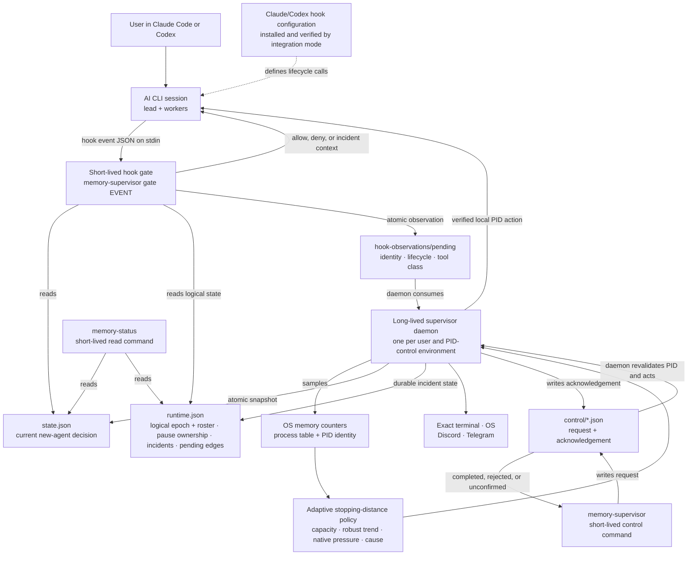
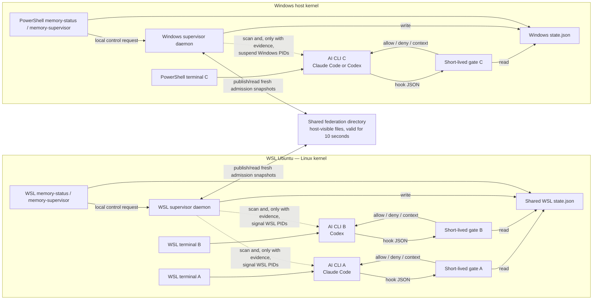

# Architecture and runtime topology

<p align="center">
  <strong>English</strong> · <a href="architecture.ko.md">한국어</a>
</p>

## Terminology first

| Term | Exact meaning in this project |
| --- | --- |
| **User / operator** | The person using the terminal. |
| **AI CLI** | The Claude Code or Codex application that owns the interactive session and invokes hooks. |
| **Lead / main agent** | The agent coordinating one AI CLI session. |
| **Worker / subagent** | A child agent created by a lead. |
| **Logical agent** | One AI work unit identified by its session and agent ID. Several logical agents may share one operating-system process. |
| **Process ID (PID)** | The operating system's number for one running process. Actions are revalidated against its start identity so a reused number is not targeted. |
| **PID-control environment** | The local process namespace in which one daemon can enumerate and signal PIDs for one protected user: a host, one WSL distribution, a VM guest, or a PID-isolated container. It is not necessarily a distinct kernel. |
| **Supervisor daemon** | The resident native process for one protected OS user and PID-control environment. It samples visible resources, decides policy, and owns local process actions. |
| **Hook gate** | A short-lived invocation of `memory-supervisor gate <event>` started by an AI CLI before or after a supported lifecycle event. |
| **Admission** | The decision for work that has not started yet: allow it, allow while observing, hold new expansion, or reduce future work. It is separate from pausing a running process. |
| **Federation** | Sharing only the latest admission decision between local environments that use the same physical memory. It does not allow remote PID control. |
| **TTE** | “Time to exhaustion”: the estimated seconds until usable memory runs out if the current decline continues. |
| **Supervisor commands** | `memory-supervisor` and the read-only `memory-status` shortcut, which are terminal commands for inspecting or controlling the supervisor. They are not Claude Code or Codex sessions. |

The legacy field `provider` survives only in compatibility interfaces. It means the AI CLI type
(`claude` or `codex`), never the user, account, model vendor, operating system, or cloud provider.

## The most important architectural fact

Memory Supervisor does not sit between the terminal and the AI CLI. Launches stay:

```text
terminal → claude
terminal → codex
```

It is **not**:

```text
terminal → supervisor → claude/codex
```

One daemon watches the supported AI CLI process trees visible to its OS user and PID namespace.
At hook boundaries, Claude Code or Codex briefly starts the same native binary in `gate` mode.
The interactive CLI remains directly attached to the user's terminal.

## Program architecture



Every executable box is a mode or alias of one Rust binary. Only the daemon stays resident;
`gate`, `memory-status`, and the `memory-supervisor` control verbs last for one hook or command. There is no permanently
open socket: the daemon atomically publishes state, the gate reads it, and manual process actions
use a private request/acknowledgement queue so the daemon can revalidate the target before acting.
Hook observations are one-way atomic files, not a second scheduler: the daemon consumes them into a
monotonic logical epoch and every lead later receives the exact restricted roster.

## How a terminal, logical agent, and PID map

```text
exact terminal endpoint
└── AI CLI lead process: root PID + process start identity
    ├── logical lead: provider + session ID + `root` key
    ├── logical subagents: provider + session ID + agent ID
    │   └── may share the lead PID; they are not assumed to be OS processes
    └── OS descendants: worker/support PIDs
        └── tracked role/tree selects eligibility; PID + start identity is revalidated before signal
```

These are separate control planes:

| Target | Stable identity used | Control method | Exact limit |
| --- | --- | --- | --- |
| A future tool or subagent action | Hook payload plus logical session/agent identity | Short-lived `gate` allow/deny result | Affects only the action about to start; it cannot rewind work or signal a process. |
| A logical agent sharing an AI CLI process | Provider, session, and agent identity recorded in `runtime.json`; the lead uses the `root` key | Logical state: `ACTIVE`, `NO_EXPANSION`, `LIGHT_WORK_ONLY`, or `HANDOFF_ONLY` | Restricts named future-work classes at hooks; it cannot OS-pause one thread inside a shared PID. |
| A worker/support process | PID and process start identity; tracked role and process-tree relationship select eligibility | Daemon-owned local suspend/resume | Acts only inside the local PID-control environment after exact process-identity revalidation. |
| A lead process | Root PID, start identity, and exact terminal identity | Same local suspend/resume path, with a terminal-identity precheck and required notice write | A pause is rolled back if durable ownership cannot be recorded or its exact terminal cannot receive the notice. |
| Terminal/model context | POSIX TTY device identity or Windows console identity | Terminal banner now; structured incident context at the next hook | A terminal is a visibility route, not the actuator, and no command is injected into it. |

On Linux and macOS, the TTY (terminal device) must canonicalize under `/dev/pts/` or `/dev/tty`, be a character device owned
by the supervisor's effective user, and retain the recorded `device:inode:rdev` identity; the notice
uses a nonblocking write. On Windows, the supervisor attaches to the target PID's console, matches
the recorded console-window-plus-target-PID identity, and writes to `CONOUT$`.

The control sequence is deliberately split:

1. Before a supported action, the AI CLI invokes `gate`. The gate reads the current machine
   admission and logical roster, emits one bounded observation, and returns an allow/deny result.
2. The resident daemon samples native memory and the visible process trees, consumes observations,
   and publishes `state.json` plus the durable logical/incident ledger in `runtime.json`.
3. `HOLD` closes new expansion. Under `DRAIN`, attributed pressure or an explicit local budget can
   progressively restrict named agents' future work; external-only pressure does not restrict or
   pause existing AI work.
4. A physical pause is a separate backstop. Tracked role/tree and growth evidence select an eligible
   candidate. Immediately before a signal, the daemon rereads the exact PID and start identity and,
   for a lead, verifies that the recorded terminal is still the same eligible terminal. It suspends
   that one PID, records and durably persists pause ownership plus the incident, and then writes the
   notice. If persistence or the required lead notice fails, it resumes the process instead of
   leaving an unowned or invisible pause.

Worker/support processes may not own a separate terminal. Their incident is therefore surfaced
through the lead's next hook context and configured OS or remote notification routes.

## Three simultaneous terminals: two WSL, one PowerShell

Terminals A and B use the **same WSL distribution and protected user**, so they share one local
PID-control environment and daemon. Terminal C runs natively in Windows PowerShell and uses a
separate Windows daemon.



| Item | A and B in the same WSL distribution | WSL and Windows |
| --- | --- | --- |
| Supervisor daemon | Shared | Separate |
| Detected capacity | Same WSL/cgroup-visible capacity | Separately measured Linux-guest and Windows-host capacity |
| Admission decision | Shared local decision | Worst fresh decision shared through federation |
| Hard cap | One WSL aggregate, if explicitly enabled | Separate cap per control environment; never pooled |
| PID pause/resume | WSL daemon can act on local WSL PIDs | Neither daemon can signal a PID outside its PID-control environment |
| `memory-status --all` | Shows both local sessions | Can combine fresh snapshots from both sides |

WSL 2 distributions can share the managed VM, Linux kernel, and host-backed memory pool while still
using separate PID, mount, user, and cgroup namespaces. Each distribution therefore needs its own
local instance. Federation coordinates only admission; it does not add RAM totals, move workers,
change remote settings, or turn a WSL PID signal into Windows memory reclamation.

## Tool and new-worker execution sequence

```mermaid
sequenceDiagram
    participant D as Local supervisor daemon
    participant S as state.json
    participant A as Claude Code or Codex lead
    participant G as Short-lived gate process

    loop every supervisor tick
        D->>D: sample native memory and visible AI CLI PIDs
        D->>D: evaluate adaptive policy and fresh federation peers
        D->>S: atomically publish effective admission state
    end

    A->>G: invoke broad PreToolUse with event JSON on stdin
    G->>S: read fresh machine admission and exact logical state
    alt ordinary work and logical state allows its class
        G-->>A: exit 0 without a denial
        A->>A: existing useful work continues
    else actual expansion in ALLOW or OBSERVE
        G-->>A: exit 0 without a denial
        A->>A: AI CLI may create the worker
    else actual expansion and HOLD or DRAIN persists through bounded recheck
        G-->>A: valid hook deny JSON + ADMISSION_DEFERRED
        Note over A: Existing work continues; the new worker is never created
    else exact logical state excludes this future-work class
        G-->>A: valid deny with state, epoch, reason, and current roster
        Note over A: Result, message, status, stop, and recovery paths remain open
    else state is missing, stale, malformed, or unreadable
        G-->>A: fail open with exit 0
        Note over D: Independent daemon/PID protection remains the backstop
    end
```

The daemon owns measurement, adaptive batch size, and policy; the gate only classifies the current
input and applies the latest snapshot before allocation. This keeps hooks fast and coordinates A,
B, and C without a central network service.

## Repository file structure

```text
Calando/
├── src/
│   ├── main.rs + lib.rs        one binary, subcommand and alias routing
│   ├── config.rs               defaults, overrides, notification configuration
│   ├── platform.rs             Linux/WSL, macOS, Windows sensors and PID actions
│   ├── policy.rs               adaptive levels, TTE, reserve, attribution, candidates
│   ├── containment.rs          logical states, tool classes, identities, strict runaway gates
│   ├── supervisor.rs           one-second control loop and protective actions
│   ├── runtime.rs + events.rs  durable pause/incident state and user messages
│   ├── gate.rs                 hook admission and incident-context response
│   ├── status.rs + control.rs  memory-status and memory-supervisor control behavior
│   ├── notify.rs + terminal.rs optional routes and exact-terminal delivery
│   ├── integration.rs          CLI version checks, owned hook merge, path migration
│   └── storage.rs              private directories and atomic/bounded file I/O
├── SKILL.md                    shared Claude Code/Codex operating skill
├── agents/                     Codex skill presentation metadata
├── commands/                   Claude and Codex in-CLI status shortcuts
├── hooks/ + adapters/          fail-open wrappers and compatibility templates
├── bin/                        command launchers
├── bootstrap.*                 public release source and binary install/update
├── install.* + power.* + uninstall.* transactional lifecycle and persistent power control
├── notify/                     default private-notification template and wrapper
├── scripts/                    release source packaging and artifact verification
├── docs/
│   ├── guides/                 installation, usage, security, and architecture guides
│   └── testing/                public test coverage and reproducible results
├── tests/                      Rust, install, platform, and contract tests
├── .github/workflows/         Linux/Windows/Apple Silicon test matrix
└── Cargo.toml + Cargo.lock     Rust package and pinned dependency graph
```

Installer-generated hooks call `memory-supervisor gate <event>` directly. `hooks/` and `adapters/`
hold fail-open contracts, compatibility, and tests; they are not another
resident daemon.

## Installed file and process layout

| Purpose | Linux / WSL / macOS | Windows |
| --- | --- | --- |
| Maintained checkout | `~/.local/share/memory-supervisor` | `%LOCALAPPDATA%\MemorySupervisor` |
| Native runtime | `~/.local/lib/memory-supervisor/memory-supervisor` | `$HOME\.local\lib\memory-supervisor\memory-supervisor.exe` |
| User commands | `~/.local/bin/memory-supervisor` and `memory-status` symlinks | `$HOME\.local\bin\*.cmd` launchers |
| Current snapshot and runtime ledger | `~/.cache/memory-supervisor/` | `$HOME\.cache\memory-supervisor\` |
| Configuration | `~/.config/memory-supervisor/` | `$HOME\.config\memory-supervisor\` |
| Path pointers and default federation | `~/.memory-supervisor/` | `$HOME\.memory-supervisor\` |
| Persistent power state | `~/.memory-supervisor/power-off` | `$HOME\.memory-supervisor\power-off` |
| Long-lived startup | user systemd, macOS LaunchAgent, or supervised fallback | `MemorySupervisor` Scheduled Task |
| Claude Code integration | `~/.claude/settings.json`, skill and command directories | Same paths below `$HOME` |
| Codex integration | `$CODEX_HOME/hooks.json` (otherwise `~/.codex/hooks.json`), `~/.agents/skills`, compatibility prompt/skill | The environment's effective `CODEX_HOME`; skill and compatibility files remain below `$HOME` |

The checkout supplies updates; the copied native runtime serves the service and hooks.
`memory-status` is an alias of that binary, and every control verb is a `memory-supervisor`
subcommand. There is one resident daemon per installed user and PID-control environment, not per
terminal or AI CLI.
When the `off` marker exists, the daemon does not run and gates pass through without a fail-open
warning. Service registration and hook wiring remain installed, so `on` can remove the marker and
restart the same installation.

## Module ownership rules

- `platform` measures and performs low-level local PID operations; it does not choose policy.
- `policy` decides stopping distance, pressure, and candidate evidence; it does not send signals.
- `containment` defines logical identity, tool/state contracts, and runaway evidence; it does not
  perform an OS action.
- `supervisor` is the only long-lived owner that combines both and records durable actions.
- `gate` can allow/deny a classified future action and deliver context; it cannot pause a process.
- A `memory-supervisor` control verb requests an action; the daemon revalidates and executes it.
- `federation` shares admission snapshots only; every PID action remains local to its owning
  PID-control environment.

These boundaries are why multiple terminals coordinate without forcing users to launch Claude Code
or Codex through a special wrapper.
