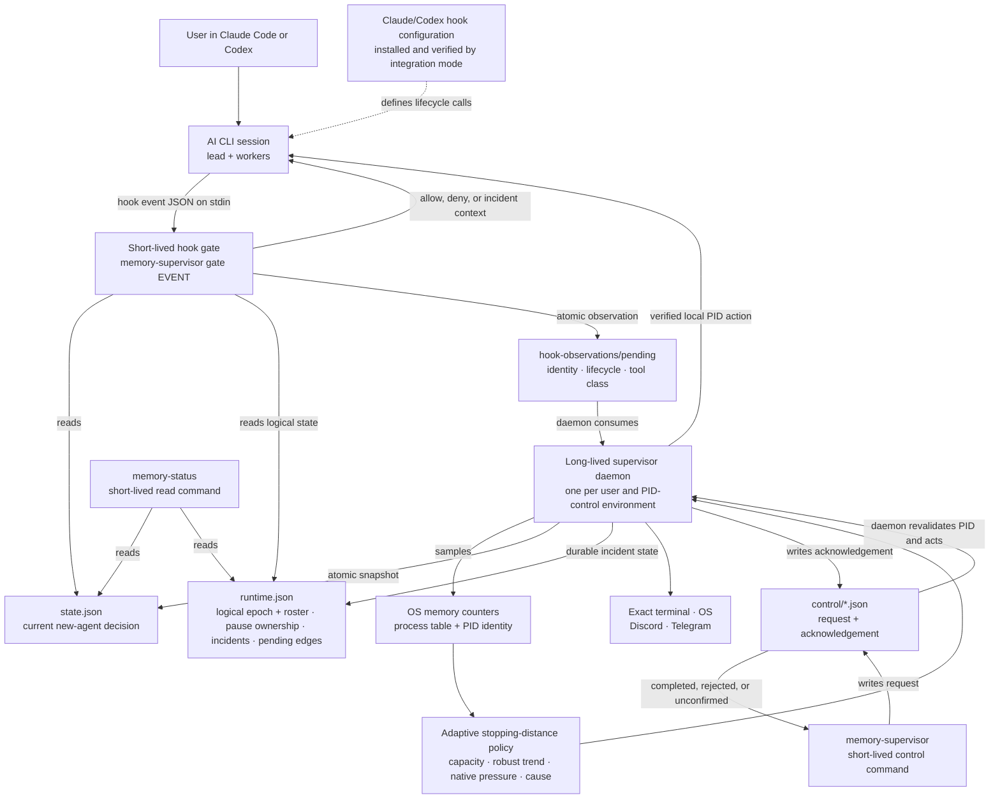
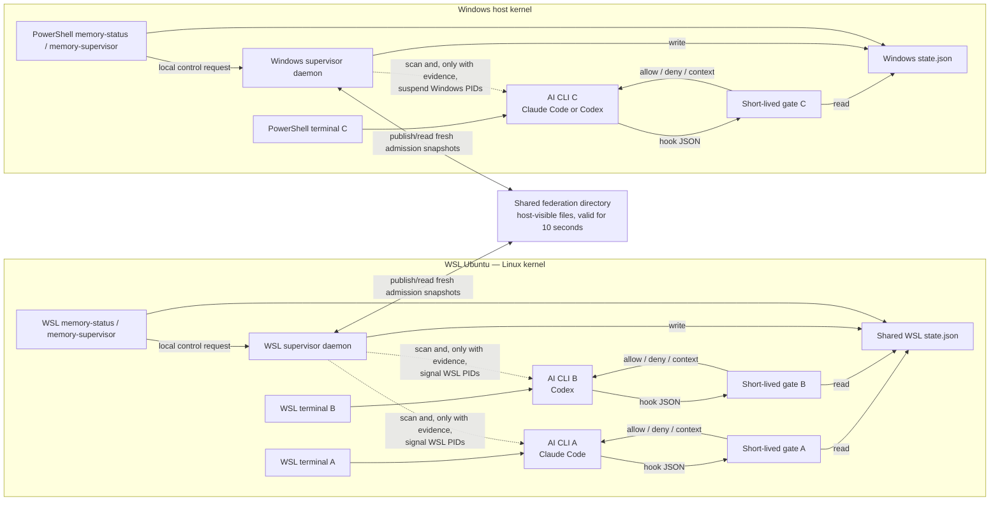

# 架构和运行时拓扑

<p align="center">
  <a href="architecture.md">English</a> · <a href="architecture.ko.md">한국어</a> · <strong>简体中文</strong> · <a href="architecture.ja.md">日本語</a>
</p>

<a id="terminology-first"></a>
## 术语第一

| 学期 | 在这个项目中的确切含义 |
| --- | --- |
| **用户/操作员** | 使用终端的人。 |
| **AI CLI** | 拥有交互式会话并调用 hooks 的 Claude Code 或 Codex 应用程序。 |
| **Lead / 主代理** | 协调一个 AI CLI 会话的代理。 |
| **Worker / subagent** | 由 lead 创建的 child 代理。 |
| **逻辑代理** | 一个 AI 工作单元由其会话和代理 ID 标识。 多个逻辑代理可以共享一个操作系统进程。 |
| **进程 ID (PID)** | 操作系统中一个正在运行的进程的编号。 操作将根据其起始标识重新验证，因此重复使用的号码不会成为目标。 |
| **PID控制环境** | 本地进程命名空间，其中一个 daemon 可以为一个受保护的用户枚举和发出 PID：一台主机、一个 WSL 发行版、一台 VM 来宾或一个 PID 隔离的容器。 它不一定是一个独特的内核。 |
| **Supervisor daemon** | 一个受保护操作系统用户和 PID 控制环境的常驻本机进程。 它对可见资源进行采样、决定策略并拥有本地流程操作。 |
| **Hook 门** | 在受支持的生命周期事件之前或之后，由 AI CLI 启动的`memory-supervisor gate <event>` 的短暂调用。 |
| **Admission** | 对于尚未开始的工作的决定：允许，边观察边允许，保持新的扩展，或者减少未来的工作。 它与暂停正在运行的进程是分开的。 |
| **Federation** | 在使用相同物理内存的本地环境之间仅共享最新的admission决策。 它不允许远程 PID 控制。 |
| **TTE** | “耗尽时间”：如果当前下降继续，可用内存耗尽之前的估计秒数。 |
| **Supervisor命令** | `memory-supervisor` 和只读的`memory-status` 快捷方式，它们是用于检查或控制supervisor 的终端命令。 它们不是 Claude Code 或 Codex 会话。 |

遗留字段`provider`仅在兼容接口中存在。 它表示 AI CLI 类型（`claude` 或 `codex`），而不是用户、帐户、模型供应商、操作系统或云提供商。

<a id="the-most-important-architectural-fact"></a>
## 最重要的建筑事实

Memory Supervisor 不在终端和 AI CLI 之间。 发布时间：

```text
terminal → claude
terminal → codex
```

它**不是**：

```text
terminal → supervisor → claude/codex
```

其中一个daemon 监视对其操作系统用户和 PID 命名空间可见的受支持的 AI CLI 进程树。 在 hook 边界，Claude Code 或 Codex 会在 `gate` 模式下短暂启动相同的本机二进制文件。 交互式 CLI 仍然直接连接到用户的终端。

<a id="program-architecture"></a>
## 程序架构



每个可执行框都是一个 Rust 二进制文件的模式或别名。 只有 daemon 保持常驻； `gate`、`memory-status` 和 `memory-supervisor` 控制动词最后一个 hook 或命令。 没有永久打开的套接字：daemon原子地发布状态，门读取它，并且手动处理操作使用私有请求/确认队列，因此daemon可以在操作之前重新验证目标。 Hook 观察结果是单向原子文件，而不是第二个调度程序：daemon 将它们消耗到单调逻辑纪元中，并且每个 lead 随后都会收到精确的受限名册。

<a id="how-a-terminal-logical-agent-and-pid-map"></a>
## 终端、逻辑代理和 PID 如何映射

```text
exact terminal endpoint
└── AI CLI lead process: root PID + process start identity
    ├── logical lead: provider + session ID + `root` key
    ├── logical subagents: provider + session ID + agent ID
    │   └── may share the lead PID; they are not assumed to be OS processes
    └── OS descendants: worker/support PIDs
        └── tracked role/tree selects eligibility; PID + start identity is revalidated before signal
```

这些是单独的控制平面：

| 目标 | 使用稳定身份 | 控制方式 | 精确极限 |
| --- | --- | --- | --- |
| 未来的工具或subagent行动 | Hook 有效负载加上逻辑会话/代理身份 | 短暂的 `gate` 允许/拒绝结果 | 仅影响即将开始的动作； 它不能倒带工作或发出进程信号。 |
| 共享 AI CLI 进程的逻辑代理 | `runtime.json`中记录了提供者、会话和代理身份； lead 使用 `root` 密钥 | 逻辑状态：`ACTIVE`、`NO_EXPANSION`、`LIGHT_WORK_ONLY` 或 `HANDOFF_ONLY` | 限制指定的未来工作类别为hooks； 它无法在操作系统中暂停共享 PID 内的一个线程。 |
| worker/支持流程 | PID和进程启动标识； 跟踪角色和进程树关系选择资格 | Daemon拥有的本地暂停/恢复 | 仅在精确的进程身份重新验证后在本地 PID 控制环境内起作用。 |
| lead 流程 | 根 PID、启动标识和确切的终端标识 | 相同的本地挂起/恢复路径，具有终端身份预检查和所需的通知写入 | 如果无法记录持久所有权或其确切终端无法接收通知，则回滚暂停。 |
| 终端/模型上下文 | POSIX TTY 设备标识或 Windows 控制台标识 | 现在终端横幅； 下一个hook的结构化事件上下文 | 终端是可见性路由，而不是执行器，并且没有命令注入其中。 |

在Linux和macOS上，TTY（终端设备）必须在`/dev/pts/`或`/dev/tty`下规范化，是supervisor有效用户拥有的字符设备，并保留记录的`device:inode:rdev`身份； 该通知使用非阻塞写入。 在 Windows 上，supervisor 连接到目标 PID 的控制台，匹配记录的 console-window-plus-target-PID 标识，并写入 `CONOUT$`。

控制序列被故意分割：

1. 在执行受支持的操作之前，AI CLI 会调用`gate`。 该门读取当前机器admission和逻辑名册，发出一个有界观察，并返回允许/拒绝结果。
2. 驻留的daemon对本机内存和可见进程树进行采样，消耗观察结果，并发布`state.json`以及`runtime.json`中的持久逻辑/事件分类帐。
3. `HOLD` 关闭新扩展。 在`DRAIN`下，归因压力或明确的当地预算可能会逐渐限制指定代理人的未来工作； 仅外部压力不会限制或暂停现有的人工智能工作。
4. 物理暂停是一种单独的支持。 跟踪的角色/树和成长证据选择合格的候选人。 在发出信号之前，daemon 会重新读取确切的 PID 和启动标识，并且对于 lead，验证记录的终端是否仍然是同一合格终端。 它暂停一个PID，记录并持久保留暂停所有权和事件，然后写入通知。 如果持久性或所需的lead通知失败，它将恢复该过程，而不是留下无主或不可见的暂停。

Worker/支持进程可能不拥有单独的终端。 因此，他们的事件通过lead的下一个hook上下文和配置的操作系统或远程通知路由浮出水面。

<a id="three-simultaneous-terminals-two-wsl-one-powershell"></a>
## 三个同步终端：两个 WSL、一个 PowerShell

终端 A 和 B 使用**相同的 WSL 分布和受保护用户**，因此它们共享一个本地 PID 控制环境和daemon。 终端 C 在 Windows PowerShell 中本机运行，并使用单独的 Windows daemon。



| 物品 | A 和 B 位于同一 WSL 分布中 | WSL 和 Windows |
| --- | --- | --- |
| Supervisordaemon | 共享 | 分离 |
| 检测容量 | 相同的 WSL/cgroup 可见容量 | 单独测量 Linux 来宾和 Windows 主机容量 |
| Admission 决定 | 共同的当地决策 | 通过federation分享的最糟糕的新决定 |
| 硬顶 | 一个 WSL 聚合（如果显式启用） | 每个控制环境有单独的上限； 从未汇集过 |
| PID暂停/恢复 | WSL daemon 可以作用于本地 WSL PID | daemon 都无法在其 PID 控制环境之外发出 PID 信号 |
| `memory-status --all` | 显示两个本地会话 | 可以结合双方的新鲜快照 |

WSL 2 发行版可以共享托管 VM、Linux 内核和主机支持的内存池，同时仍然使用单独的 PID、挂载、用户和 cgroup 命名空间。 因此，每个发行版都需要自己的本地实例。 仅Federation坐标admission； 它不会添加 RAM 总数、移动 workers、更改远程设置或将 WSL PID 信号转换为 Windows 内存回收。

<a id="tool-and-new-worker-execution-sequence"></a>
## 工具和new-worker执行顺序

```mermaid
sequenceDiagram
    participant D as Local supervisor daemon
    participant S as state.json
    participant A as Claude Code or Codex lead
    participant G as Short-lived gate process

    loop every supervisor tick
        D->>D: sample native memory and visible AI CLI PIDs
        D->>D: evaluate adaptive policy and fresh federation peers
        D->>S: atomically publish effective admission state
    end

    A->>G: invoke broad PreToolUse with event JSON on stdin
    G->>S: read fresh machine admission and exact logical state
    alt ordinary work and logical state allows its class
        G-->>A: exit 0 without a denial
        A->>A: existing useful work continues
    else actual expansion in ALLOW or OBSERVE
        G-->>A: exit 0 without a denial
        A->>A: AI CLI may create the worker
    else actual expansion and HOLD or DRAIN persists through bounded recheck
        G-->>A: valid hook deny JSON + ADMISSION_DEFERRED
        Note over A: Existing work continues; the new worker is never created
    else exact logical state excludes this future-work class
        G-->>A: valid deny with state, epoch, reason, and current roster
        Note over A: Result, message, status, stop, and recovery paths remain open
    else state is missing, stale, malformed, or unreadable
        G-->>A: fail open with exit 0
        Note over D: Independent daemon/PID protection remains the backstop
    end
```

daemon拥有测量、自适应批量大小和策略； 该门仅对当前输入进行分类，并在分配前应用最新的快照。 这使得 hooks 保持快速并在没有中央网络服务的情况下协调 A、B 和 C。

<a id="repository-file-structure"></a>
## 存储库文件结构

```text
Calando/
├── README.*                    concise public entry points in four languages
├── bootstrap.*                 stable one-line release installer
├── install.* + power.* + uninstall.* v0.2.0-compatible maintenance entrypoints
├── Cargo.toml + Cargo.lock     Rust package and pinned dependency graph
├── src/
│   ├── main.rs + lib.rs        one binary, subcommand and alias routing
│   ├── config.rs               defaults, overrides, notification configuration
│   ├── platform.rs             Linux/WSL, macOS, Windows sensors and PID actions
│   ├── policy.rs               adaptive levels, TTE, reserve, attribution, candidates
│   ├── containment.rs          logical states, tool classes, identities, strict runaway gates
│   ├── supervisor.rs           one-second control loop and protective actions
│   ├── runtime.rs + events.rs  durable pause/incident state and user messages
│   ├── gate.rs                 hook admission and incident-context response
│   ├── status.rs + control.rs  memory-status and memory-supervisor control behavior
│   ├── notify.rs + terminal.rs optional routes and exact-terminal delivery
│   ├── integration.rs          CLI version checks, owned hook merge, path migration
│   └── storage.rs              private directories and atomic/bounded file I/O
├── SKILL.md                    shared Claude Code/Codex operating skill
├── agents/                     Codex skill presentation metadata
├── integrations/
│   ├── claude/                 hook template and in-CLI status command
│   └── codex/                  hook template, adapter notes, and status command
├── packaging/
│   ├── install.*               transactional runtime, service, skill, and hook setup
│   ├── power.* + uninstall.*   persistent power control and owned removal
│   └── release/                source packaging and artifact verification
├── runtime/
│   ├── bin/                    compatibility command launchers
│   ├── hooks/                  fail-open hook wrappers
│   └── notifications/          default private-notification template and wrapper
├── docs/
│   ├── detailed-guide.*        complete four-language product guide
│   ├── guides/                 installation, usage, security, and architecture guides
│   └── testing/                public test coverage and reproducible results
├── tests/                      Rust, install, platform, and contract tests
└── .github/                    community documents and cross-platform test matrix
```

安装程序生成的hooks直接调用`memory-supervisor gate <event>`。 `runtime/hooks/` 和 `integrations/` 保存故障开放合约、兼容性和测试； 他们不是另一位居民daemon。 存储库根目录中的简短维护文件保留 v0.2.0 签出路径并委托给`packaging/`； 新的运行时代码更喜欢分组路径，并在更新期间回退到旧版布局。

<a id="installed-file-and-process-layout"></a>
## 安装的文件和进程布局

| 目的 | Linux / WSL / macOS | 视窗 |
| --- | --- | --- |
| 维护结账 | `~/.local/share/memory-supervisor` | `%LOCALAPPDATA%\MemorySupervisor` |
| 本机运行时 | `~/.local/lib/memory-supervisor/memory-supervisor` | `$HOME\.local\lib\memory-supervisor\memory-supervisor.exe` |
| 用户命令 | `~/.local/bin/memory-supervisor` 和 `memory-status` 符号链接 | `$HOME\.local\bin\*.cmd` 发射器 |
| 当前快照和运行时分类帐 | `~/.cache/memory-supervisor/` | `$HOME\.cache\memory-supervisor\` |
| 配置 | `~/.config/memory-supervisor/` | `$HOME\.config\memory-supervisor\` |
| 路径指针和默认值 federation | `~/.memory-supervisor/` | `$HOME\.memory-supervisor\` |
| 持续电源状态 | `~/.memory-supervisor/power-off` | `$HOME\.memory-supervisor\power-off` |
| 长期启动 | 用户 systemd、macOS LaunchAgent 或受监督的回退 | `MemorySupervisor` 计划任务 |
| Claude Code 集成 | `~/.claude/settings.json`，技能和命令目录 | 以下相同路径`$HOME` |
| Codex 集成 | `$CODEX_HOME/hooks.json`（否则`~/.codex/hooks.json`）、`~/.agents/skills`、兼容性提示/技能 | 环境有效`CODEX_HOME`； 技能和兼容性文件仍低于`$HOME` |

结帐提供更新； 复制的本机运行时提供服务和hooks。 `memory-status` 是该二进制文件的别名，每个控制动词都是一个 `memory-supervisor` 子命令。 每个已安装的用户和 PID 控制环境都有一个常驻 daemon，而不是每个终端或 AI CLI。 当 `off` 标记存在时，daemon 不会运行，并且闸门通过时不会出现故障打开警告。 服务注册和hook接线仍保持安装状态，因此`on`可以删除标记并重新启动相同的安装。

<a id="module-ownership-rules"></a>
## 模块所有权规则

- `platform` 测量并执行低级本地 PID 运算； 它不选择政策。
- `policy`决定停止距离、压力、候选证据； 它不发送信号。
- `containment`定义了逻辑身份、工具/状态契约和失控证据； 它不执行操作系统操作。
- `supervisor`是唯一一个结合了两者并记录持久行为的长寿所有者。
- `gate` 可以允许/拒绝机密的未来操作并提供上下文； 它不能暂停进程。
- `memory-supervisor` 控制动词请求一个动作； daemon 重新验证并执行它。
- `federation` 仅共享 admission 快照； 每个 PID 操作都保留在其所属的 PID 控制环境中。

这些边界就是为什么多个终端可以协调而不强迫用户通过特殊包装器启动Claude Code或Codex。
